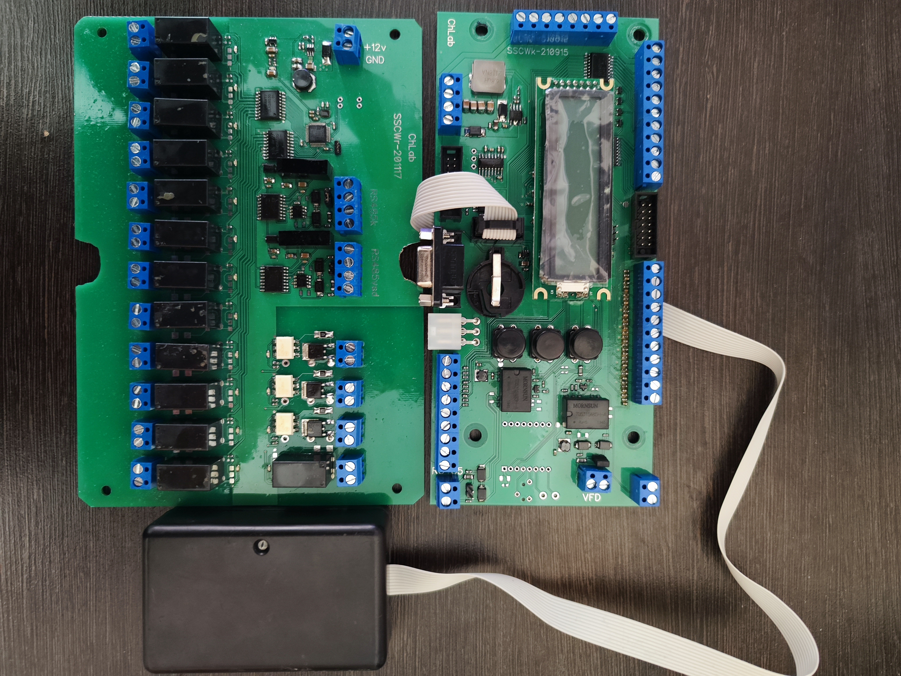

# О проекте
Это устройство – контроллер мойки самообслуживания. Оплата принимается через POS терминал VENDOTEK (протокол VTK), купюроприёмник ICT (протокол ICT) и манетоприемник (импульсы). Имеется считыватель карт лояльности. Есть 3 настраиваемых импульсных входа для подключения платежных устройств с импульсными выходами. Предусмотрены режимы: вода, пена, воск, осмос, пылесос, воздух, пауза. Управление насосами происходит с помощью 13-и релейных и 3-х симисторных силовых выходов. Сопоставление режимов и силовых выходов гибко настраивается в меню монохромного символьного дисплея. Пользователь выбирает режимы нажатием кнопки. Информация о выбранном режиме и остатке денежных средств отображается на матричном дисплее.

